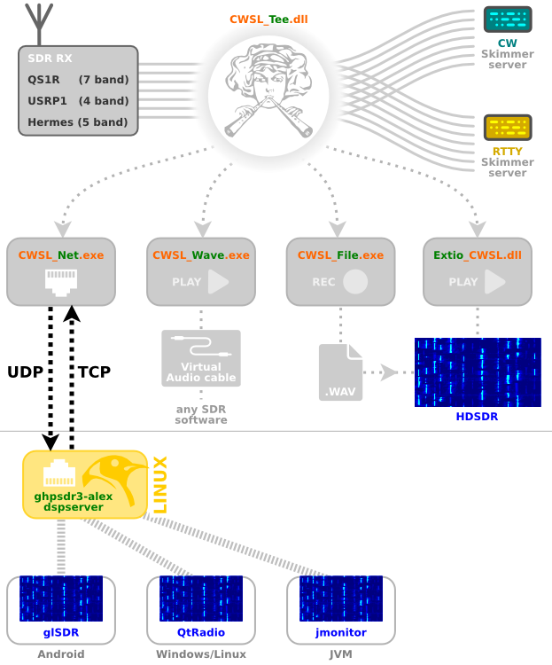

CWSL is a set of utilities to allow further use of data from SDR receiver connected to the [Skimmer server](http://www.dxatlas.com/SkimServer/). 
This is done through the special dll CWSL_Tee, whitch acts as driver for another SDR receiver. 
It is inserted between the real driver of SDR receiver and Skimmer server.
Data from the SDR receiver going through this library, which is storing it in circular buffers in shared memory of the computer. 
All other applications running on the same computer can use it from these buffers.

**Currently there are ready four such applications:**

*   **CWSL_File** for storing data into Winrad-like wav files for later use
*   **Extio_CWSL** for use it in real time by Winrad.
*   **CWSL_Wave** for sending it into sound card - typically into [Virtual Audio Cable](http://software.muzychenko.net/eng/vac.htm) for using this IQ data into another SDR software
*   **CWSL_Net** as CWSL CLI based IQ server for the [ghpsdr3-alex](http://napan.ca/ghpsdr3/index.php/Main_Page) project

**Installation procedure is follows:**

1.  Unpack file [IPP70.zip (98 MB)](./bin/IPP70.zip) into directory in the system path (for example to c:\windows\system32 on 32-bit Windows or c:\windows\SysWOW64 on 64-bit Windows). Do not replace dbghelp.dll and msvcp100.dll if they already exist. This will install Intel Integrated Primitives library redistributables.
2.  Run [vcredist_x86.exe (14 MB)](./bin/vcredist_x86.exe), this will install right version of C runtime libraries.
3.  Copy [CWSL_Tee.dll](./bin/CWSL_Tee.dll) and [CWSL_Tee.cfg](./bin/CWSL_Tee.cfg) into Skimmer server directory. Typically **c:\Program Files\Afreet\SkimSrv**.
4.  If you want use other SDR than QS1R, change change name of underlying library in file CWSL_Tee.cfg.
5.  Start Skimmer server and select "CWSL_Tee on ..." from combo on tab "Skimmer".
6.  Now you can copy CWSL_File.exe into desired directory and run it with band number (or some frequency from the desired band) on the command line. It will start recording of selected band into wav file. Every minute it print '.' like sign, that it working. Every hour it create new file. You can change this length to half or quarter of hour by command line switches. When you run programm without any parameters, it will print a little help about it. Recorded files you may use in Winrad (or one of its successors like [HDSDR](http://www.hdsdr.de/)), [SpectraVue](http://www.moetronix.com/spectravue.htm) or [CW Skimmer](http://www.dxatlas.com/CwSkimmer). Recording can be stopped by pressing any key or Ctrl+C.
7.  You can also copy Extio_CWSL.dll into Winrad directory. Typically **c:\Program Files\Winrad**. Then you can start Winrad and in menu "Show options/Select input" select "CWSL". In dialog window in upper right corner you can select band that you want to listen.

**Note about Scale_factor:**

Skimmer server use 24-bits sampling. This sampling can cover signal with dynamics about 144 dB. 
But signals on the one band usually do not such dynamics. 
Usually suffice 96 dB, which can be achieved using 16-bit sampling. 
The resulting data is then a third smaller, which is of course important especially when saving them to disk. 
CWSL_File at the default settings because do such conversion.

Scaling factor is just the parameter for this conversion. 
Specifies the number of bits to rotate the original sample to the right, before trimming to 16 bits. 
The appropriate value of this factor must be determined experimentally for each band separately. 
We use the HDSDR with Extio_CWSL.dll for it.

From version 1.7 CWSL_File  allows to use the original dynamics and avoid experimenting with this factor. 
So if you do not mind a slightly larger files size, you can specify Scaling\_factor value -2 for all bands.

**Changes in version 2.0**

CWSL_Tee now supports multiple instances of Skimmer Server on the same SDR hardware. The first running instance creates a shared memory and write IQ data into it (like in version 1.X). The folowing instances open this memory and read IQ data from it.

**Collaboration with WebSDR**

Thanks to extension described [here](http://www.dl1glh.de/cwsl_websdr.html) the IQ data from CWSL now can be consumed by popular [WebSDR](http://websdr.org/) On the Linux side, the data is send to the ALSA software framework. In my opinion, then they should also be used with other Linux SDR programs. Thanks Hardy!
